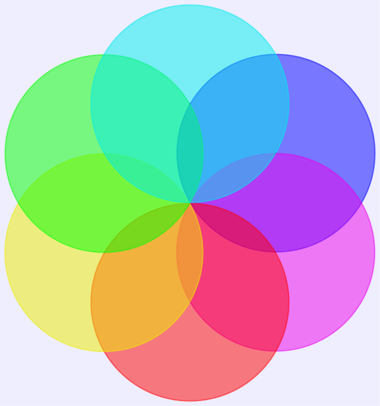
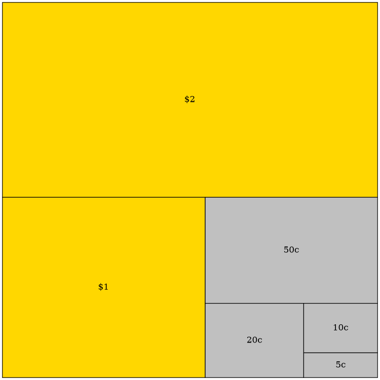
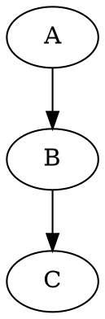
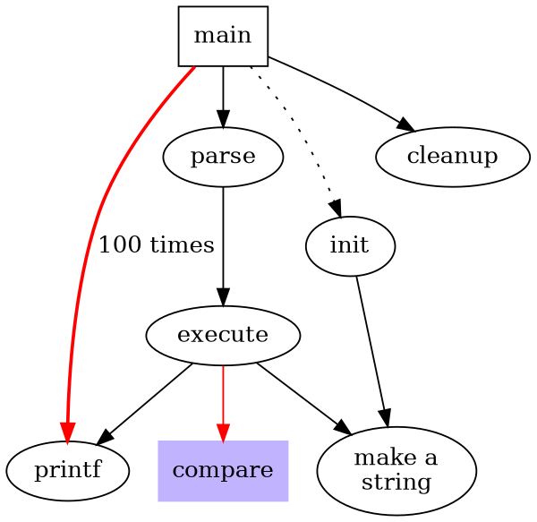
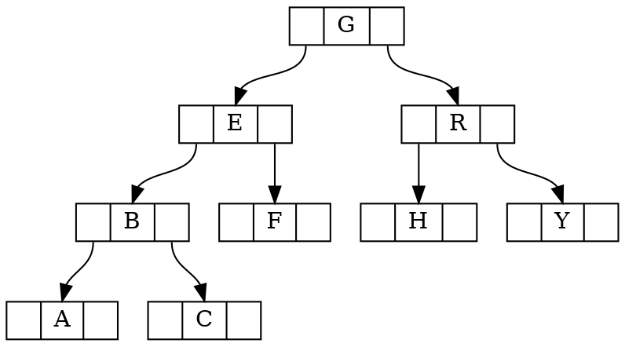

## Sample Text

### Third-level header

#### Fourth-level header

A paragraph (with a footnote):

**Lorem ipsum** dolor sit amet, con<sub>s</sub>ectetur adipi<sup>s</sup>cing elit, sed do eiusmod
tempor incididunt ut labore et dolore *magna aliqua*. Ut enim ad minim veniam,
quis nostrud exercitation ullamco laboris nisi ut aliquip ex ea commodo
consequat. Aute ~~irure~~ dolor in reprehenderit in voluptate velit esse cillum
dolore eu fugiat nulla pariatur. Excepteur sint occaecat cupidatat non proident,
sunt in culpa qui officia deserunt mollit anim id est laborum.[^1]

[^1]: I'm sure you are bored by the text here.

```ansi
 ✓ src/index.test.ts (1)
   Test Files  1 passed (1)
        Tests  1 passed (1)
     Start at  23:32:41
     Duration  11ms
   PASS  Waiting for file changes...
         press h to show help, press q to quit
```

```d2
*.style.font-size: 22
*.*.style.font-size: 22

title: |md
  # Terraform resources (v1.0.0)
| {near: top-center}

direction: right

project_connection: {
  style: {
    fill: "#C5C6C7"
    stroke: grey
  }
}

privatelink_endpoint: {tooltip: Datasource only}
group
group_partial_permissions
service_token
job: {
  style: {
    fill: "#ACE1AF"
    stroke: green
  }
}

conns: Connections (will be removed in the future,\nuse global_connection) {
  bigquery_connection
  fabric_connection
  connection

  bigquery_connection.style.fill: "#C5C6C7"
  fabric_connection.style.fill: "#C5C6C7"
  connection.style.fill: "#C5C6C7"
}
conns.style.fill: "#C5C6C7"

env_creds: Environment Credentials {
  grid-columns: 2
  athena_credential
  databricks_credential
  snowflake_credential
  bigquery_credential
  fabric_credential
  postgres_credential: {tooltip: Is used for Redshift as well}
  teradata_credential
}

service_token -- project: can scope to {
  style: {
    stroke-dash: 3
  }
}
group -- project
group_partial_permissions -- project
user_groups -- group
user_groups -- group_partial_permissions
project -- environment
project -- snowflake_semantic_layer_credential
job -- environment
job -- environment_variable_job_override
notification -- job
partial_notification -- job

webhook -- job: triggered by {
  style: {
    stroke-dash: 3
  }
}
environment -- global_connection
environment -- conns
global_connection -- privatelink_endpoint
global_connection -- oauth_configuration

environment -- env_creds
conns -- privatelink_endpoint
project -- project_repository
lineage_integration -- project
project_repository -- repository
environment -- environment_variable
environment -- partial_environment_variable
environment -- extended_attributes
environment -- semantic_layer_configuration
model_notifications -- environment

project -- project_connection {
  style: {
    stroke: "#C5C6C7"
  }
}
project_connection -- conns {
  style: {
    stroke: "#C5C6C7"
  }
}

(job -- *)[*].style.stroke: green
(* -- job)[*].style.stroke: green

account_level_settings: "Account level settings" {
  account_features
  ip_restrictions_rule
  license_map
  partial_license_map
}
account_level_settings.style.fill-pattern: dots
```

List:

1. item1
2. item2
3. item3
   - style1
   - style2[^2]
   - style3
4. item4

[^2]: dmlfjeklfeklfm

A blockquote (a gray bar at the left and lightgray background):

> *Quisque mattis volutp*at lorem vitae feugiat. Praesent porta est quis porta
> imperdiet. Aenean porta, mi non cursus volutpat, mi est mollis libero, id
> suscipit orci urna a augue. In fringilla euismod lacus, vitae tristique massa
> ultricies vitae. Mauris acc*um*san ligula tristique, viverra nulla sed, porta
> sapien. Vestibulum fac**ili**sis nec nisl验证楷体 blandit convallis. Maecenas venenatis
> porta malesuada. Ut ac erat tortor. Orci varius natoque penatibus et magnis
> dis parturient montes, nascetur ridiculus mus. Nulla sodales quam sit amet
> tincidunt egestas. In et turpis at orci vestibulum ullamcorper. Aliquam sed
> ante libero. Sed hendrerit arcu lacus.
>
> --- by Someone





GitHub style alerts：

> [!NOTE]
> Useful information that users should know, even when skimming content.

> [!TIP]
> Helpful advice for doing things better or more easily.

> [!IMPORTANT]
> Key information users need to know to achieve their goal.

> [!WARNING]
> Urgent info that needs immediate user attention to avoid problems.

> [!CAUTION]
> Advises about risks or negative outcomes of certain actions.

A full-width table:

| Sepal.Length | Sepal.Width | Petal.Length | Petal.Width | Species | dsk |
|-------------:|------------:|-------------:|------------:|:--------|-----|
|          5.1 |         3.5 |          1.4 |         0.2 | setosa  | aaa |
| `abc`    4.9 |         3.0 |          1.4 |         0.2 | setosa  | aaa |
|          4.7 |         3.2 |          1.3 |         0.2 | setosa  | aaa |
|          4.6 |         3.1 |          1.5 |         0.2 | setosa  | aaa |
|          5.0 |         3.6 |          1.4 |         0.2 | setosa  | aaa |
|          5.4 |         3.9 |          1.7 |         0.4 | setosa  | aaa |

| 名称        | 描述       | 数量 |
|:-----------|:----------:|-----:|
| Item A     | 这是 Item A |   10 |
| Item B     | 这是 Item B |    5 |

An image:


Display math (render by MathJax):

$$
|x| = \begin{cases} x & \text{if } x \geq 0 \\ -x & \text{if } x < 0  \end{cases}
$$

$$
\varlimsup_{n \to \infty}
$$

Inline math:

ni $ a^*=x-b^* $ hao

Definition list:







## [Another Section](https://www.baidu.com)

Inline code and `<kbd>` style:

How about <kbd>Ctrl</kbd> + <kbd>C</kbd> and <kbd>Ctrl</kbd> + <kbd>V</kbd>?

Codeblock display:

```go
// GetTitleFunc returns a func that can be used to transform a string to title case.
// The supported styles are
// - "Go" (strings.Title)
// - "AP" (see https://www.apstylebook.com/)
// - "Chicago" (see https://www.chicagomanualofstyle.org/home.html)
func GetTitleFunc(style string) func(s string) string {
  switch strings.ToLower(style) {
  case "go":
    return strings.Title
  case "chicago":
    return transform.NewTitleConverter(transform.ChicagoStyle)
  default:
    return transform.NewTitleConverter(transform.APStyle)
  }
}
```

```diff lang="bash"
- pnpm add -D vuepress@next
+ pnpm add -D vuepress@next @vuepress/client@next vue
```

---Hope you will enjoy it.
