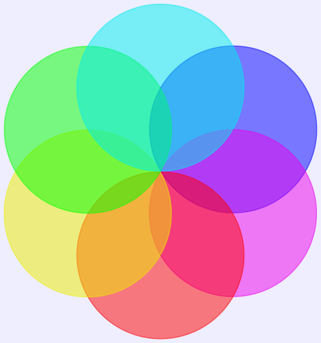
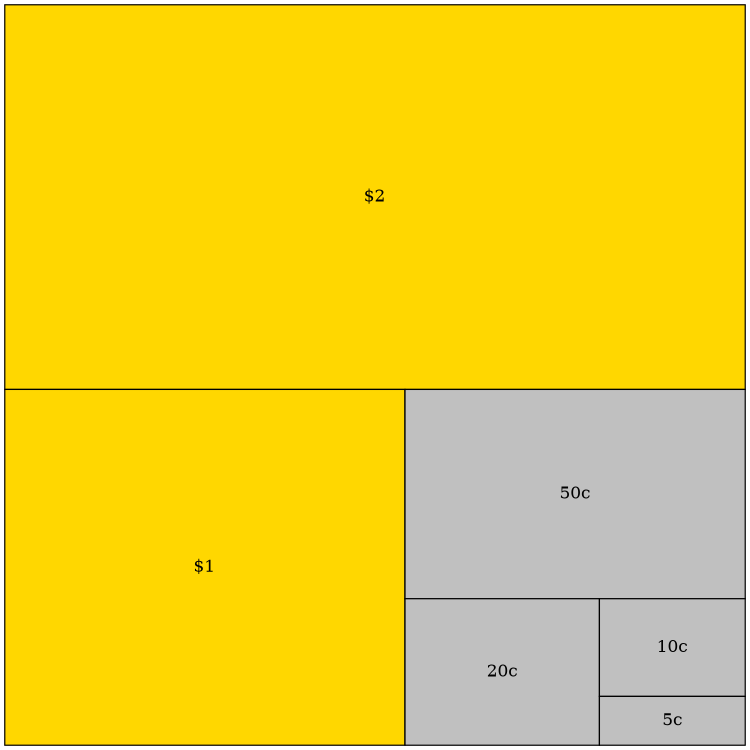
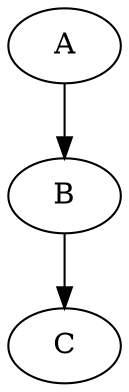
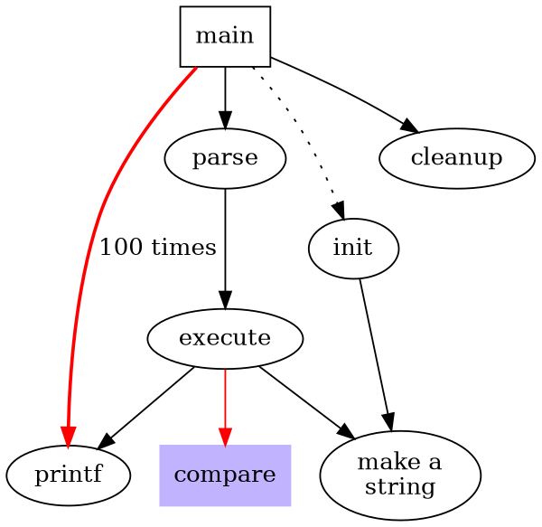
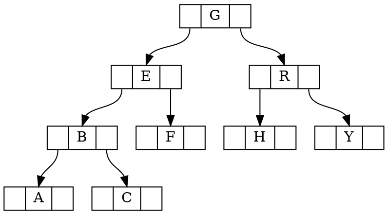

## Sample Text

### Third-level header

#### Fourth-level header

A paragraph (with a footnote):

**Lorem ipsum** dolor sit amet, con<sub>s</sub>ectetur adipi<sup>s</sup>cing elit, sed do eiusmod
tempor incididunt ut labore et dolore *magna aliqua*. Ut enim ad minim veniam,
quis nostrud exercitation ullamco laboris nisi ut aliquip ex ea commodo
consequat. Aute ~~irure~~ dolor in reprehenderit in voluptate velit esse cillum
dolore eu fugiat nulla pariatur. Excepteur sint occaecat cupidatat non proident,
sunt in culpa qui officia deserunt mollit anim id est laborum.[^1]

[^1]: I'm sure you are bored by the text here.

```ansi
 ✓ src/index.test.ts (1)
   Test Files  1 passed (1)
        Tests  1 passed (1)
     Start at  23:32:41
     Duration  11ms
   PASS  Waiting for file changes...
         press h to show help, press q to quit
```

```d2
*.style.font-size: 22
*.*.style.font-size: 22

title: |md
  # Terraform resources (v1.0.0)
| {near: top-center}

direction: right

project_connection: {
  style: {
    fill: "#C5C6C7"
    stroke: grey
  }
}

privatelink_endpoint: {tooltip: Datasource only}
group
group_partial_permissions
service_token
job: {
  style: {
    fill: "#ACE1AF"
    stroke: green
  }
}

conns: Connections (will be removed in the future,\nuse global_connection) {
  bigquery_connection
  fabric_connection
  connection

  bigquery_connection.style.fill: "#C5C6C7"
  fabric_connection.style.fill: "#C5C6C7"
  connection.style.fill: "#C5C6C7"
}
conns.style.fill: "#C5C6C7"

env_creds: Environment Credentials {
  grid-columns: 2
  athena_credential
  databricks_credential
  snowflake_credential
  bigquery_credential
  fabric_credential
  postgres_credential: {tooltip: Is used for Redshift as well}
  teradata_credential
}

service_token -- project: can scope to {
  style: {
    stroke-dash: 3
  }
}
group -- project
group_partial_permissions -- project
user_groups -- group
user_groups -- group_partial_permissions
project -- environment
project -- snowflake_semantic_layer_credential
job -- environment
job -- environment_variable_job_override
notification -- job
partial_notification -- job

webhook -- job: triggered by {
  style: {
    stroke-dash: 3
  }
}
environment -- global_connection
environment -- conns
global_connection -- privatelink_endpoint
global_connection -- oauth_configuration

environment -- env_creds
conns -- privatelink_endpoint
project -- project_repository
lineage_integration -- project
project_repository -- repository
environment -- environment_variable
environment -- partial_environment_variable
environment -- extended_attributes
environment -- semantic_layer_configuration
model_notifications -- environment

project -- project_connection {
  style: {
    stroke: "#C5C6C7"
  }
}
project_connection -- conns {
  style: {
    stroke: "#C5C6C7"
  }
}

(job -- *)[*].style.stroke: green
(* -- job)[*].style.stroke: green

account_level_settings: "Account level settings" {
  account_features
  ip_restrictions_rule
  license_map
  partial_license_map
}
account_level_settings.style.fill-pattern: dots
```

List:

1. item1
2. item2
3. item3
   - style1
   - style2[^2]
   - style3
4. item4

[^2]: dmlfjeklfeklfm

A blockquote (a gray bar at the left and lightgray background):

> *Quisque mattis volutp*at lorem vitae feugiat. Praesent porta est quis porta
> imperdiet. Aenean porta, mi non cursus volutpat, mi est mollis libero, id
> suscipit orci urna a augue. In fringilla euismod lacus, vitae tristique massa
> ultricies vitae. Mauris acc*um*san ligula tristique, viverra nulla sed, porta
> sapien. Vestibulum fac**ili**sis nec nisl验证楷体 blandit convallis. Maecenas venenatis
> porta malesuada. Ut ac erat tortor. Orci varius natoque penatibus et magnis
> dis parturient montes, nascetur ridiculus mus. Nulla sodales quam sit amet
> tincidunt egestas. In et turpis at orci vestibulum ullamcorper. Aliquam sed
> ante libero. Sed hendrerit arcu lacus.
>
> --- by Someone





GitHub style alerts：

> [!NOTE]
> Useful information that users should know, even when skimming content.

> [!TIP]
> Helpful advice for doing things better or more easily.

> [!IMPORTANT]
> Key information users need to know to achieve their goal.

> [!WARNING]
> Urgent info that needs immediate user attention to avoid problems.

> [!CAUTION]
> Advises about risks or negative outcomes of certain actions.

A full-width table:

| Sepal.Length | Sepal.Width | Petal.Length | Petal.Width | Species | dsk |
|-------------:|------------:|-------------:|------------:|:--------|-----|
|          5.1 |         3.5 |          1.4 |         0.2 | setosa  | aaa |
| `abc`    4.9 |         3.0 |          1.4 |         0.2 | setosa  | aaa |
|          4.7 |         3.2 |          1.3 |         0.2 | setosa  | aaa |
|          4.6 |         3.1 |          1.5 |         0.2 | setosa  | aaa |
|          5.0 |         3.6 |          1.4 |         0.2 | setosa  | aaa |
|          5.4 |         3.9 |          1.7 |         0.4 | setosa  | aaa |

| 名称        | 描述       | 数量 |
|:-----------|:----------:|-----:|
| Item A     | 这是 Item A |   10 |
| Item B     | 这是 Item B |    5 |

An image:


Display math (render by MathJax):

$$
|x| = \begin{cases} x & \text{if } x \geq 0 \\ -x & \text{if } x < 0  \end{cases}
$$

$$
\varlimsup_{n \to \infty}
$$

Inline math:

ni $ a^*=x-b^* $ hao

```typst
#import "@preview/cetz:0.4.2": canvas, draw
#import draw: circle, content, line, rect

#set page(width: auto, height: auto, margin: 8pt)

#canvas({
  // Styles
  let arrow-style = (mark: (end: "stealth", fill: black, scale: 0.5, offset: 1pt), stroke: .5pt)
  let node-style = (stroke: 0.7pt)
  let layer-sep = 2 // now vertical separation
  let horiz-sep = 1.3 // horizontal separation between nodes in a layer

  // Helper to draw a vertical layer of nodes
  let draw-layer(y, nodes, prefix: "", masks: none, x-offset: 0) = {
    for i in range(nodes) {
      let x = (nodes - 1) * horiz-sep / 2 - i * horiz-sep + x-offset
      circle(
        (x, y),
        radius: 0.3,
        name: prefix + str(i),
        ..node-style,
      )
      if masks != none {
        content((x, y), str(masks.at(i)))
      }
    }
  }

  // Helper to connect all nodes between layers
  let connect-layers(from-prefix, to-prefix, from-nodes, to-nodes) = {
    for i in range(from-nodes) {
      for j in range(to-nodes) {
        line(
          from-prefix + str(i),
          to-prefix + str(j),
          ..arrow-style,
        )
      }
    }
  }

  // Adjust x-positions for the three components
  let fcnn-x = -5 // Autoencoder on the left
  let mask-x = 0 // Masks in the middle
  let made-x = 5 // MADE network on the right

  // Draw autoencoder (left side)
  // Draw all layers from bottom to top
  for (idx, (y, nodes)) in (
    (0, 3),
    (layer-sep, 4),
    (2 * layer-sep, 4),
    (3 * layer-sep, 3),
  ).enumerate() {
    draw-layer(y, nodes, prefix: "fcnn" + str(idx) + "-", x-offset: fcnn-x)
  }

  // Connect autoencoder layers and add weight labels
  for (from-idx, to-idx, layer-label) in ((0, 1, $W_1$), (1, 2, $W_2$), (2, 3, $V$)) {
    let from-prefix = "fcnn" + str(from-idx) + "-"
    let to-prefix = "fcnn" + str(to-idx) + "-"
    let from-nodes = if from-idx == 0 { 3 } else { 4 }
    let to-nodes = if to-idx == 3 { 3 } else { 4 }

    // Draw all connections
    for i in range(from-nodes) {
      for j in range(to-nodes) {
        line(
          from-prefix + str(i),
          to-prefix + str(j),
          ..arrow-style,
        )
      }
    }

    // Add weight label next to middle connection
    let mid-y = (from-idx + 0.5) * layer-sep
    content(
      (fcnn-x + 2.1 + if layer-label == $W_2$ { 0.3 } else { 0 }, mid-y),
      layer-label,
    )
  }

  // Draw mask matrices in the middle
  let mask-base-size = 1.25
  let mask-sep = 2.5

  // Helper to draw grid lines and filled cells
  let draw-mask(x, y, rows, cols, filled-cells) = {
    let width = mask-base-size * cols / 3 // normalize to make 3 cols = base size
    let height = mask-base-size * rows / 3 // normalize to make 3 rows = base size
    let cell-width = width / cols
    let cell-height = height / rows

    // Draw grid lines
    for i in range(cols + 1) {
      let x-pos = x - width / 2 + i * cell-width
      line(
        (x-pos, y),
        (x-pos, y + height),
        stroke: .2pt,
      )
    }
    for i in range(rows + 1) {
      let y-pos = y + i * cell-height
      line(
        (x - width / 2, y-pos),
        (x + width / 2, y-pos),
        stroke: .2pt,
      )
    }

    // Fill cells
    for (row, col) in filled-cells {
      rect(
        (x - width / 2 + col * cell-width, y + (rows - row - 1) * cell-height),
        (x - width / 2 + (col + 1) * cell-width, y + (rows - row) * cell-height),
        fill: black,
      )
    }
  }

  // Draw M_V mask (top, 2x4)
  let mv-width = mask-base-size * 4 / 3
  let mv-height = mask-base-size * 2 / 3
  rect(
    (mask-x - mv-width / 2, 2 * mask-sep),
    (mask-x + mv-width / 2, 2 * mask-sep + mv-height),
    name: "mv-box",
  )
  content((rel: (-.8, 0), to: "mv-box.west"), $M_V =$)
  draw-mask(mask-x, 2 * mask-sep, 2, 4, ((0, 1), (0, 2), (1, 0), (1, 1), (1, 2), (1, 3)))

  // Draw M_W2 mask (middle, 4x4)
  let mw2-size = mask-base-size * 4 / 3
  rect(
    (mask-x - mw2-size / 2, mask-sep),
    (mask-x + mw2-size / 2, mask-sep + mw2-size),
    name: "mw2-box",
  )
  content((rel: (-.8, 0), to: "mw2-box.west"), $M_(W_2) =$)
  draw-mask(mask-x, mask-sep, 4, 4, ((0, 0), (0, 2), (0, 3), (3, 0), (3, 2), (3, 3)))

  // Draw M_W1 mask (bottom, 4x3)
  let mw1-width = mask-base-size
  let mw1-height = mask-base-size * 4 / 3
  rect(
    (mask-x - mw1-width / 2, 0),
    (mask-x + mw1-width / 2, mw1-height),
    name: "mw1-box",
  )
  content((rel: (-.8, 0), to: "mw1-box.west"), $M_(W_1) =$)
  draw-mask(mask-x, 0, 4, 3, ((0, 0), (1, 0), (2, 0), (3, 0), (2, 2)))

  // Draw MADE (right side)
  // Draw MADE layers with masks
  for (idx, (y, nodes, masks)) in (
    (0, 3, (3, 1, 2)),
    (layer-sep, 4, (2, 1, 2, 2)),
    (2 * layer-sep, 4, (1, 2, 2, 1)),
    (3 * layer-sep, 3, (3, 1, 2)),
  ).enumerate() {
    draw-layer(y, nodes, prefix: "made" + str(idx) + "-", masks: masks, x-offset: made-x)
  }

  // Connect MADE layers with masked connections
  // Layer 1 -> 2
  for (from, tos) in ((0, ()), (1, (0, 1, 2, 3)), (2, (0, 2, 3))) {
    let from-node = "made0-" + str(from)
    for to in tos {
      line("made0-" + str(from), "made1-" + str(to), ..arrow-style)
    }
  }

  // Layer 2 -> 3
  for (from, tos) in ((0, (1, 2)), (1, (0, 1, 2, 3)), (2, (1, 2)), (3, (1, 2))) {
    for to in tos {
      line("made1-" + str(from), "made2-" + str(to), ..arrow-style)
    }
  }

  // Layer 3 -> 4
  for (from, tos) in ((0, (0, 2)), (1, (0,)), (2, (0,)), (3, (0, 2))) {
    for to in tos {
      line("made2-" + str(from), "made3-" + str(to), ..arrow-style)
    }
  }

  // Add input and output labels
  for i in range(3) {
    content((rel: (0, -0.6), to: "fcnn0-" + str(i)), $x_#i$)
    content((rel: (0, 0.6), to: "fcnn3-" + str(i)), $hat(x)_#i$)
    content((rel: (0, -0.6), to: "made0-" + str(i)), $x_#i$)
  }

  // Add MADE output labels
  content((rel: (0, 0.6), to: "made3-0"), $p(x_3|x_2)$)
  content((rel: (0, 0.6), to: "made3-1"), $p(x_2)$)
  content((rel: (-.2, 0.6), to: "made3-2"), $p(x_1|x_2,x_3)$)

  // Add bottom labels with vertical alignment and larger font
  let label-size = 1.5em
  let bottom-y = -1.5 // Fixed baseline for all bottom labels
  content((fcnn-x, bottom-y), text(weight: "bold", size: label-size)[autoencoder])
  content((mask-x - 2, bottom-y), text(weight: "bold", size: label-size)[$times$])
  content((mask-x, bottom-y), text(weight: "bold", size: label-size)[masks])
  content((mask-x + 2, bottom-y), text(weight: "bold", size: label-size)[$arrow.r$])
  content((made-x, bottom-y), text(weight: "bold", size: label-size)[MADE])
})

```







## [Another Section](https://www.baidu.com)

Inline code and `<kbd>` style:

How about <kbd>Ctrl</kbd> + <kbd>C</kbd> and <kbd>Ctrl</kbd> + <kbd>V</kbd>?

Codeblock display:

```go
// GetTitleFunc returns a func that can be used to transform a string to title case.
// The supported styles are
// - "Go" (strings.Title)
// - "AP" (see https://www.apstylebook.com/)
// - "Chicago" (see https://www.chicagomanualofstyle.org/home.html)
func GetTitleFunc(style string) func(s string) string {
  switch strings.ToLower(style) {
  case "go":
    return strings.Title
  case "chicago":
    return transform.NewTitleConverter(transform.ChicagoStyle)
  default:
    return transform.NewTitleConverter(transform.APStyle)
  }
}
```

```diff lang="bash"
- pnpm add -D vuepress@next
+ pnpm add -D vuepress@next @vuepress/client@next vue
```

---Hope you will enjoy it.
